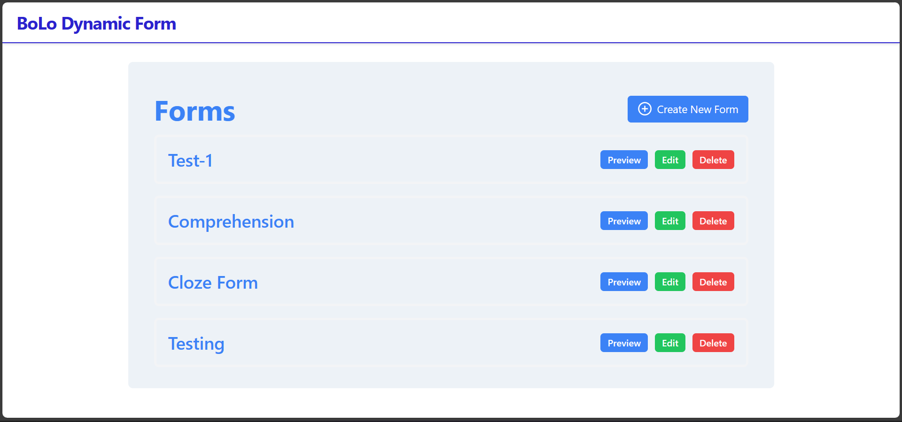
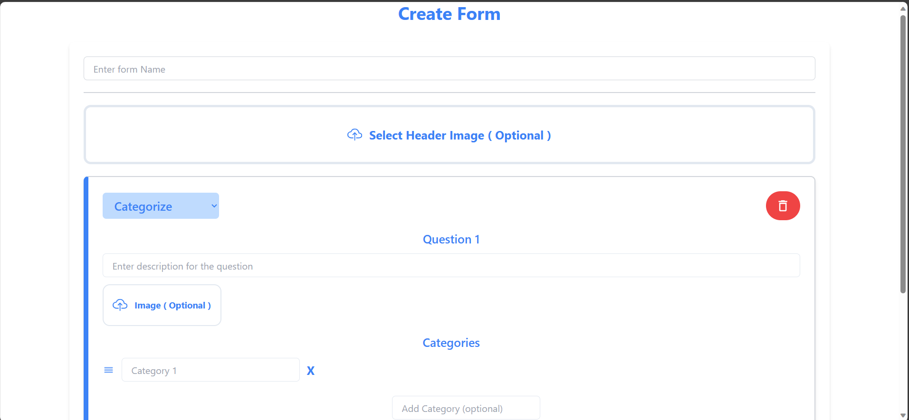
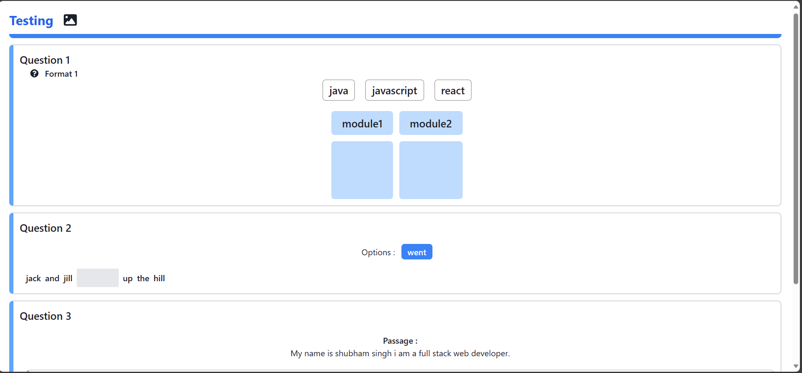

# bolo-round-1

* Bolo Forms is an interactive platform where users can effortlessly craft, modify, and preview forms using a user-friendly drag-and-drop interface. With a range of input options and customizable designs, it simplifies the process of creating forms, ensuring an intuitive experience throughout.

# Deployed Links-
* Backend- https://bolo-server.onrender.com
* Frontend-https://bolo-frontend.vercel.app/

# Functionality Built-
* Creating Forms: Utilize a drag-and-drop interface to effortlessly add and personalize form elements.
* Managing Forms: Access a centralized dashboard to view, edit, delete, and preview forms.
* Live Preview: See immediate visual updates as changes are applied to form layout or elements.
* Three Types of forms-Categorize, Cloze, and Comprehension with drag and drop feature as per the requirement.

# Technologies Used-

### For Backend-

* Express(As per the requirement in the Question)
* Node(As per the requirement in the Question)
* MongoDB(As per the requirement in the Question)
* Mongoose(As per the requirement in the Question)

### For Frontend/UI-

* React
* Tailwind CSS(As per the requirement in the Question)
* ChakrUI
* Cloudinary

# HomePage-

# CreateForm-

# Preview-

